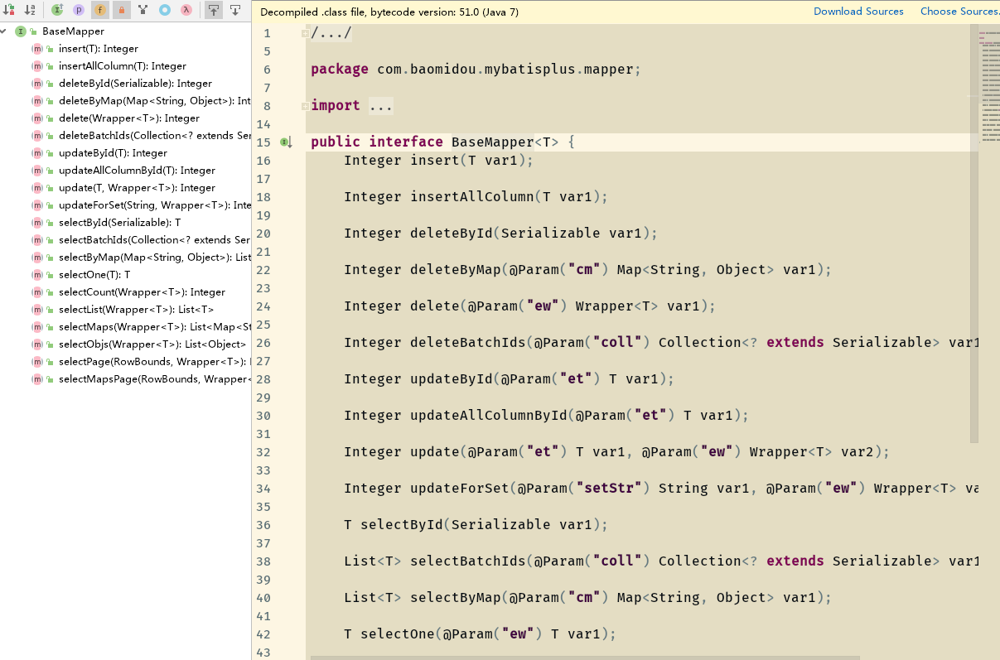
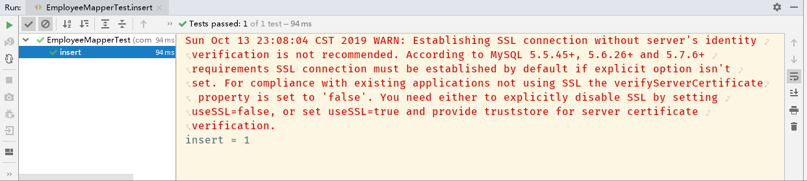

---
title:MyBatisPlus_视频教程
time:2019年10月13日
---

[toc]

## 〇、视频介绍

视频来源于[尚硅谷_MyBatisPlus视频教程](http://www.atguigu.com/download_detail.shtml?v=32)，在线观看地址：https://www.bilibili.com/video/av28331070。


## 一、MybatisPlus简介

### 1.1 介绍


MyBatis-Plus(简称 简称 MP), 是一个 MyBatis  的增强 工具包，只做增强不做改变.  为简化开
发工作、提高生产率而生
我们的愿景是成为 Mybatis  最好的搭档，就像  魂斗罗  中的 1P 、2P ，基友搭配，效率
翻倍。


### 1.2 代码及文档

官方地址：http://mp.baomidou.com；

代码发布地址:
	Github: https://github.com/baomidou/mybatis-plus
	Gitee: https://gitee.com/baomidou/mybatis-plus
文档发布地址:
	http://mp.baomidou.com/#/?id=%E7%AE%80%E4%BB%8B


### 1.3 前置知识

学习MybatisPlus以前，需要先熟悉掌握Mybatis以及Spring-Mybatis的整合。


## 二、MybatisPlus环境搭建

在使用MybatisPlus以前，我们需要准备环境。环境的准备分为以下几个方面：

1. 数据库环境：①在本地或者远程有一个可以正常连接的数据库； ②准备好若干张表以及表中的数据；
1. Spring-Mybatis环境整合；

下面，开始搭建MybatisPlus的环境搭建。


### 2.1 创建测试表

我们通过数据库可视化工具在数据库中创建测试数据库和表，脚本如下：

```sql
-- 创建库
CREATE DATABASE mp;
-- 使用库
USE mp;
-- 创建表
CREATE TABLE tbl_employee(
id INT(11) PRIMARY KEY AUTO_INCREMENT,
last_name VARCHAR(50),
email VARCHAR(50),
gender CHAR(1),
age int
);


insert into tbl_employee(last_name,email,gender,age) values('Tom', 'tom@atguigu.com', 1, 22);
insert into tbl_employee(last_name,email,gender,age) values('Jerry', 'jerry@atguigu.com',0, 25);
insert into tbl_employee(last_name,email,gender,age) values('Black', 'black@atguigu.com', 1, 30);
insert into tbl_employee(last_name,email,gender,age) values('White', 'white@atguigu.com', 0, 35);
```


### 2.2 搭建Spring-Mybatis环境

#### 2.2.1 搭建Spring的项目，并整合Mybatis

详细搭建步骤请参考其他文章。

1. [SSM开发代码整合](https://github.com/Litexplorer/slip_tech/blob/master/01%20Spring%E5%B8%B8%E7%94%A8%E9%85%8D%E7%BD%AE/SSM%E9%A1%B9%E7%9B%AE%E5%BC%80%E5%8F%91%E4%BB%A3%E7%A0%81%E6%95%B4%E5%90%88.md)；


#### 2.2.2 修改mybatis依赖

把Mybatis的依赖去掉，并添加MybatisPlus的依赖：

```xml
<!--MybatisPlus依赖-->
<dependency>
  <groupId>com.baomidou</groupId>
  <artifactId>mybatis-plus</artifactId>
  <version>2.3</version>
</dependency>
```


#### 2.2.4 集成MybatisPlus

Mybatis-Plus 的集成非常简单，对于 Spring，我们仅仅需要把 Mybatis 自带的`MybatisSqlSessionFactoryBean `替换为 MP 自带的即可：

```xml
<!--  配置工厂  -->
<!--Mybatis自带的是：org.mybatis.spring.SqlSessionFactoryBean   
        修改为MybatisPlus的工厂：com.baomidou.mybatisplus.spring.MybatisSqlSessionFactoryBean
    -->
<bean class="com.baomidou.mybatisplus.spring.MybatisSqlSessionFactoryBean" id="factory">
  <property name="dataSource" ref="dataSource"/>
  <!--  加载mybatis全局配置文件  -->
  <property name="configLocation" value="classpath:mybatis/mybatis-config.xml"/>
</bean>
```

此时，项目中已经集成了MybatisPlus插件。


## 三、MybatisPlus入门HelloWorld

经过上面的步骤以后，我们的项目中已经可以使用MybatisPlus的功能了。我们先介绍MybatisPlus的通用CRUD功能。

### 3.1 通用CRUD

1) 提出问题:
假设我们已存在一张 `tbl_employee `表，且已有对应的实体类 `Employee`，实现`tbl_employee `表的 CRUD 操作我们需要做什么呢？

2）实现方式：

- 基于传统Mybatis：
  - 需要编写 `EmployeeMapper `接口，并手动编写 CRUD 方法；
  - 提供 `EmployeeMapper.xml `映射文件，并手动编写每个方法对应的 SQL 语句；
- 基于MybatisPlus：
  - 只需要创建 `EmployeeMapper` 接口, 并继承 `BaseMapper `接口.这就是使用 MP需要完成的所有操作，甚至不需要创建SQL映射文件；（注意：有时候也是要创建的）


#### 3.1.0 编写mapper接口以及设置实体类与表之间的对应关系

我们在上面搭建的环境的基础上，新建一个JavaBean与数据库表**tbl_employee**对应：具体代码如下：

```java
@Getter
@Setter
@Accessors(chain = true) // ①
@TableName("tbl_employee")  // ②
public class Employee {

    @TableId(type = IdType.AUTO)  // ③
    private Integer id;
    private String lastName;
    private String email;
    private Integer gender;
    private Integer age;

}
```

①：这是lombok插件的“链式编程”的注解配置；使用了这个注解，可以实现bean.setXXX().setXXX…之类的链式编程；

②：注解`@TableName`中指定了当前实体类和数据库中哪个表相对应；

③：注解`@TableId`指定哪个字段需要是当前表的主键，其中`type`属性指定主键的增长策略；


编写$mapper$​接口：

在MybatisPlus中只需要让$mapper$接口继承`BaseMapper`接口即可：

```java
public interface EmployeeMapper extends BaseMapper<Employee> {
}
```

`BaseMapper`中的泛型是对应的数据库表的bean。


#### 3.1.1 插入操作

使用了MybatisPlus以后，我们不需要再编写单表的CRUD操作的方法，也不需要编写分页的方法，这些方法都通过`BaseMapper`得到继承。

> 我们可以打开`BaseMapper`的源码查看继承的方法：
>
> 

因此，我们可以直接新建测试类，并在测试类中添加“测试insert”的方法即可。


新建测试类：

```java
public class EmployeeMapperTest extends LoadApplication {

    @Resource
    private ApplicationContext applicationContext;

    @Resource
    private EmployeeMapper employeeMapper;

    @Test
    public void insert() {
        Employee employee = new Employee()
                .setAge(15)
                .setEmail("chen@abc.com")
                .setGender(0)
                .setLastName("chen");
        Integer insert = employeeMapper.insert(employee);
        System.out.println("insert = " + insert);
    }
}
```

> 其中：类`LoadApplication`是自己编写的、加载Spring配置文件的测试类，具体代码如下：
>
> ```java
> @RunWith(SpringJUnit4ClassRunner.class)
> @ContextConfiguration({"classpath:applicationContext.xml"})
> public class LoadApplication {
> }
> ```
>
> 其他测试类继承了`LoadApplication`以后就可以加载Spring配置文件了。


测试的结果如下所示：

1. IDE控制台：
   
1. 数据库：
   

测试结果符合预期。


> #### 附：在控制台中输出SQL语句：
>
> （待完成）


